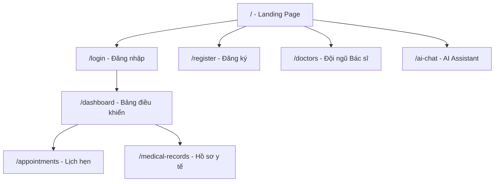

# Frontend Development Plan - AI-Powered Clinic Portal

Xây dựng giao diện frontend hiện đại, đẹp mắt cho hệ thống phòng khám thông minh, tích hợp đầy đủ với backend Spring Boot API đã hoàn thiện.

## Tech Stack

| Layer | Technology | Lý do |
|---|---|---|
| **Framework** | **Vite + React 18** | Build nhanh, HMR instant, ecosystem lớn |
| **Language** | **JavaScript (ES6+)** | Đơn giản, không cần TypeScript setup phức tạp |
| **Routing** | **React Router v6** | SPA routing chuẩn |
| **State** | **React Context + Hooks** | Đủ dùng cho scope project, không cần Redux |
| **HTTP** | **Axios** | Interceptors cho JWT, error handling tốt |
| **Styling** | **Vanilla CSS + CSS Variables** | Toàn quyền kiểm soát, performance tốt nhất |
| **Font** | **Inter (Google Fonts)** | Modern, clean, excellent readability |
| **AI Chat** | **SSE (EventSource)** | Real-time streaming từ backend |

## User Review Required

> [!IMPORTANT]
> **Tech Stack Confirmation**: Plan sử dụng **Vite + React** với **Vanilla CSS**. Nếu muốn thay đổi (Vue, Next.js, TailwindCSS...), hãy cho tôi biết.

> [!IMPORTANT]
> **Scope**: Frontend sẽ được đặt tại `frontend/` trong cùng workspace. Backend chạy port `8080` (default Spring Boot).

## Design Direction

Lấy cảm hứng từ **bachmai.gov.vn** nhưng nâng cấp thành phong cách **modern healthcare SaaS**:

- **Color Palette**: Medical blue-teal gradient (`#0A6EBD` → `#12B886`) + deep navy backgrounds (`#0F172A`)
- **Typography**: Inter font family, clean hierarchy
- **Glass morphism**: Frosted glass cards với `backdrop-filter: blur()`
- **Micro-animations**: Smooth transitions, hover effects, skeleton loading
- **Dark/Light mode**: Toggle support
- **Responsive**: Mobile-first, breakpoints tại 768px và 1024px

## Proposed Changes

### Page Architecture (7 Pages)



---

### Component 1: Project Setup

#### [NEW] frontend/ (Vite + React project)

Khởi tạo project Vite React tại `frontend/` trong workspace, bao gồm:
- `package.json` với dependencies: `react`, `react-dom`, `react-router-dom`, `axios`
- `vite.config.js` với proxy tới `http://localhost:8080` cho API calls
- `.env.development` với `VITE_API_BASE_URL=http://localhost:8080`

---

### Component 2: Design System (`frontend/src/index.css`)

#### [NEW] index.css

CSS Variables design system hoàn chỉnh:

```css
:root {
  /* Primary: Medical Blue-Teal */
  --primary: #0A6EBD;
  --primary-light: #3B8DD4;
  --accent: #12B886;
  
  /* Surfaces */
  --bg-primary: #FFFFFF;
  --bg-secondary: #F8FAFC;
  --surface-glass: rgba(255,255,255,0.7);
  
  /* Typography */
  --text-primary: #0F172A;
  --text-secondary: #64748B;
  
  /* Spacing, radius, shadows, animations */
}

[data-theme="dark"] {
  --bg-primary: #0F172A;
  --bg-secondary: #1E293B;
  --surface-glass: rgba(30,41,59,0.8);
  --text-primary: #F1F5F9;
}
```

---

### Component 3: Core Layout & Navigation

#### [NEW] frontend/src/components/layout/

| File | Mô tả |
|---|---|
| `Navbar.jsx` + `Navbar.css` | Top navigation bar: logo, menu links, auth buttons, theme toggle |
| `Footer.jsx` + `Footer.css` | Footer với thông tin liên hệ, links nhanh |
| `Sidebar.jsx` + `Sidebar.css` | Sidebar cho dashboard area (sau khi login) |
| `Layout.jsx` | Public layout wrapper (Navbar + Footer) |
| `DashboardLayout.jsx` | Private layout wrapper (Navbar + Sidebar + Content) |

---

### Component 4: Authentication Pages

#### [NEW] frontend/src/pages/Login.jsx + Login.css

- Form đăng nhập: username/email + password
- Glass morphism card, smooth validation
- Gọi `POST /api/v1/auth/login` → lưu JWT vào `localStorage`
- Redirect về `/dashboard` sau login

#### [NEW] frontend/src/pages/Register.jsx + Register.css

- Form đăng ký: username, email, password, confirm password
- Multi-step form animation
- Gọi `POST /api/v1/auth/register`

#### [NEW] frontend/src/contexts/AuthContext.jsx

- React Context quản lý auth state: `user`, `token`, `isAuthenticated`
- Auto-decode JWT để lấy role
- `login()`, `logout()`, `register()` functions
- Protected route wrapper component

---

### Component 5: Landing Page (Home)

#### [NEW] frontend/src/pages/Home.jsx + Home.css

**Sections** (Tham khảo bachmai.gov.vn):

1. **Hero Banner**: Gradient background, tagline "Chăm sóc sức khỏe thông minh", CTA buttons (Đặt lịch khám, Tư vấn AI)
2. **Quick Actions Bar**: 4 cards - Gọi tổng đài, Đặt lịch khám, Tư vấn AI, Tra cứu kết quả
3. **Chuyên khoa**: Grid cards hiển thị các chuyên khoa nổi bật
4. **Đội ngũ bác sĩ**: Carousel hiển thị top doctors từ `GET /api/v1/doctors`
5. **AI Assistant Preview**: Preview chatbox, mời dùng thử
6. **Thống kê**: Counter animation (số bác sĩ, bệnh nhân, lượt khám...)

---

### Component 6: Doctors Page

#### [NEW] frontend/src/pages/Doctors.jsx + Doctors.css

- Grid layout hiển thị danh sách bác sĩ từ `GET /api/v1/doctors`
- Search bar + filter by specialization
- Doctor card: avatar placeholder, tên, chuyên khoa, kinh nghiệm, phí tư vấn
- Pagination component
- Click vào card → modal chi tiết + nút "Đặt lịch"

---

### Component 7: AI Chat Page (Highlight Feature)

#### [NEW] frontend/src/pages/AiChat.jsx + AiChat.css

**Đây là trang showcase chính** - Giao diện chatbot hiện đại kiểu ChatGPT:

- **Chat Interface**: Message bubbles (user/AI), typing indicator, auto-scroll
- **SSE Streaming**: Kết nối `GET /api/v1/ai/chat/stream` để hiển thị response real-time, từng token một
- **Suggested Actions**: Hiển thị `suggestedActions` từ AI response dưới dạng clickable chips
- **Agent Actions**: Khi AI detect intent (đặt lịch, hủy lịch), hiển thị confirmation card trước khi gọi `POST /api/v1/ai/agent/action`
- **Conversation History**: Lưu session trong localStorage, khả năng tạo conversation mới
- **Sidebar**: Danh sách các cuộc hội thoại cũ

---

### Component 8: Dashboard (Authenticated)

#### [NEW] frontend/src/pages/Dashboard.jsx + Dashboard.css

**Dashboard tổng quan** sau khi login:

- **Stats Cards**: Tổng lịch hẹn, lịch sắp tới, lịch đã hoàn thành
- **Upcoming Appointments**: Danh sách 5 lịch hẹn gần nhất
- **Quick Actions**: Đặt lịch mới, Chat AI, Xem hồ sơ
- **Calendar Preview**: Mini calendar highlight ngày có lịch

---

### Component 9: Appointments Management

#### [NEW] frontend/src/pages/Appointments.jsx + Appointments.css

- **Table view**: Danh sách lịch hẹn từ `GET /api/v1/appointments`
- **Filters**: Theo status (PENDING/CONFIRMED/COMPLETED/CANCELLED), date range
- **Create Modal**: Form tạo lịch hẹn mới → `POST /api/v1/appointments`
- **Status badges**: Color-coded (vàng=pending, xanh=confirmed, xám=completed, đỏ=cancelled)
- **Actions**: Xác nhận, Hoàn thành, Hủy lịch

---

### Component 10: Medical Records

#### [NEW] frontend/src/pages/MedicalRecords.jsx + MedicalRecords.css

- Danh sách hồ sơ y tế từ `GET /api/v1/medical-records`
- Detail view với thông tin bệnh án
- AI Summarize button → `POST /api/v1/ai/summarize-medical-record/{id}`
- Timeline view hiển thị lịch sử khám

---

### Component 11: Shared/Reusable Components

#### [NEW] frontend/src/components/ui/

| Component | Mô tả |
|---|---|
| `Button.jsx` | Primary, secondary, outline, ghost variants |
| `Card.jsx` | Glass morphism card với hover effects |
| `Input.jsx` | Styled input với floating label |
| `Modal.jsx` | Overlay modal với animation |
| `Table.jsx` | Data table với sort, pagination |
| `Badge.jsx` | Status badges |
| `Skeleton.jsx` | Loading skeleton placeholders |
| `Toast.jsx` | Notification toast system |
| `ThemeToggle.jsx` | Dark/Light mode toggle |
| `Pagination.jsx` | Page navigation |

---

### Component 12: API Service Layer

#### [NEW] frontend/src/services/

| File | Endpoints |
|---|---|
| `api.js` | Axios instance với JWT interceptor, base URL config |
| `authService.js` | `login()`, `register()` |
| `doctorService.js` | `getAll()`, `getById()`, `getBySpecialization()` |
| `appointmentService.js` | `getAll()`, `create()`, `updateStatus()`, `cancel()` |
| `patientService.js` | `getAll()`, `getById()`, `getByCitizenId()` |
| `medicalRecordService.js` | `getAll()`, `getById()`, `getByPatientId()` |
| `aiService.js` | `chat()`, `streamChat()`, `analyzeSymptoms()`, `summarize()`, `agentAction()` |

---

## Implementation Phases

### Phase 1: Foundation (Core)
1. Khởi tạo Vite project + cài dependencies
2. Design system CSS + theme toggle
3. Layout components (Navbar, Footer, Sidebar)
4. Auth system (Login, Register, AuthContext, Protected Routes)

### Phase 2: Public Pages
5. Landing Page (Hero, Quick Actions, Doctors preview)
6. Doctors listing page

### Phase 3: AI Chat (Highlight)
7. AI Chat page với SSE streaming
8. Agent action integration

### Phase 4: Dashboard & Management
9. Dashboard overview
10. Appointments management
11. Medical Records view

### Phase 5: Polish
12. Dark mode hoàn chỉnh
13. Responsive mobile optimization
14. Loading states, error handling, toast notifications
15. SEO meta tags

## Verification Plan

### Manual Verification
- Khởi chạy backend (`./mvnw spring-boot:run`) + frontend (`npm run dev`)
- Test flow: Register → Login → Browse Doctors → AI Chat (SSE streaming) → Book Appointment → View Dashboard
- Test responsive trên mobile viewport
- Test dark/light mode toggle
- Verify JWT authentication flow (login → protected routes → token expiry)

### Browser Testing
- Sử dụng Chrome DevTools để kiểm tra:
  - Network tab: API calls, SSE connection
  - Performance: LCP, CLS metrics
  - Lighthouse: Accessibility, SEO scores

## Open Questions

> [!IMPORTANT]
> **Ngôn ngữ giao diện**: Giao diện sẽ hoàn toàn bằng **tiếng Việt**. Đúng không?

> [!NOTE]
> **Avatar bác sĩ**: Backend chưa có field `avatarUrl` trong `DoctorResponse`. Frontend sẽ sử dụng generated avatar (initials-based) thay thế. Có cần thêm field này vào backend không?
